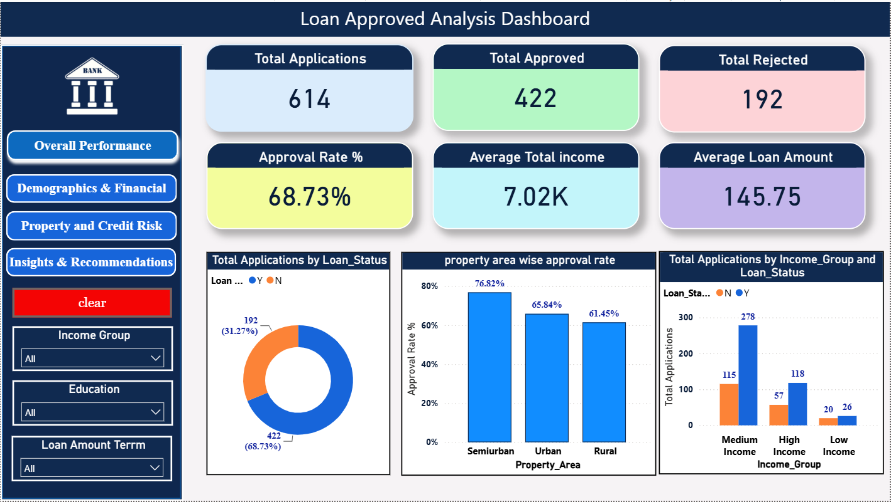
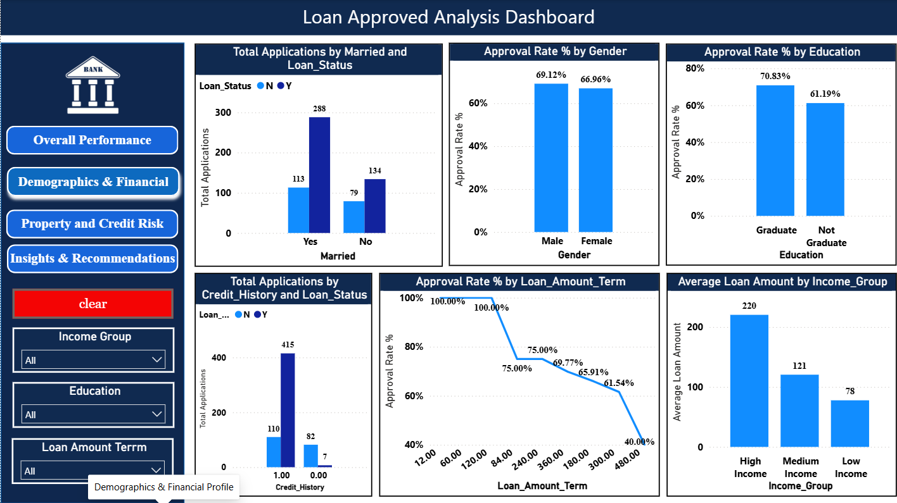
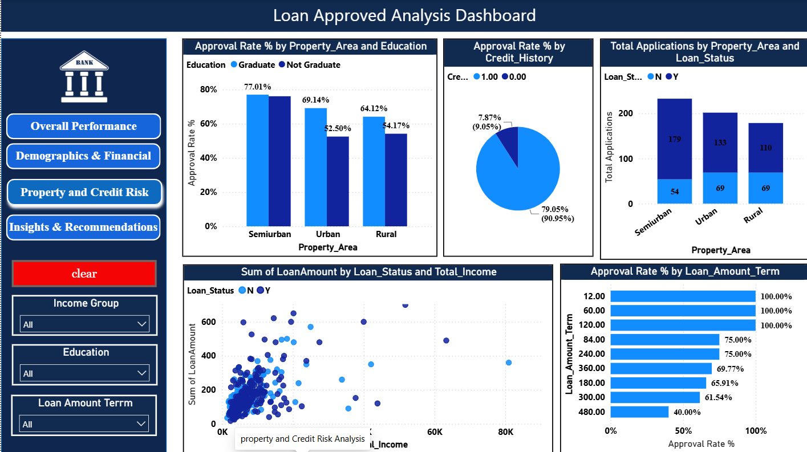
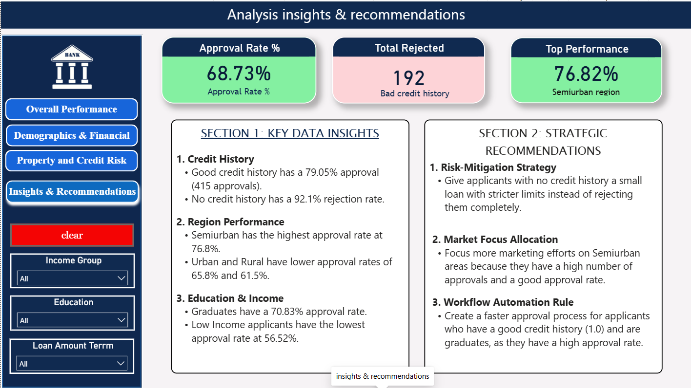

# 🏦 Bank Loan Approved Analysis

> **An end-to-end data analytics project** covering data cleaning, SQL analysis, and interactive Power BI dashboards to understand loan approval patterns across demographics, credit risk, property areas, and income groups.

## 📌 Project Overview

This project analyzes a **bank loan dataset** to answer real-world business questions about loan approvals. The workflow spans the full analytics pipeline:

1. **Raw Data Ingestion** — Original CSV with 614 loan applications
2. **Data Cleaning** — Python (Jupyter Notebook) used to handle nulls, rename columns, and engineer features
3. **SQL Analysis** — MySQL queries answering 25+ business questions across 5 sections
4. **Power BI Visualization** — Four-page interactive dashboard with slicers and cross-filtering

The goal is to help bank decision-makers understand **who gets approved, why, and where to focus resources**.


## 📂 Dataset

### `loan_approved.csv` — Raw Data (614 rows)
| Column | Description |
|---|---|
| `Loan_ID` | Unique loan application identifier |
| `Gender` | Applicant gender (Male / Female) |
| `Married` | Marital status (Yes / No) |
| `Dependents` | Number of dependents |
| `Education` | Graduate / Not Graduate |
| `Self_Employed` | Yes / No |
| `ApplicantIncome` | Monthly income of applicant |
| `CoapplicantIncome` | Monthly income of co-applicant |
| `LoanAmount` | Requested loan amount (in thousands) |
| `Loan_Amount_Term` | Repayment term (in months) |
| `Credit_History` | 1 = Good credit history, 0 = No credit history |
| `Property_Area` | Urban / Semiurban / Rural |
| `Loan_Status` | **Target** — Y (Approved) / N (Rejected) |


## 🗂️ Project Structure

```
g-pro/
├── loan_approved.csv           # Raw dataset
├── loan_approved_clean.csv     # Cleaned dataset (output of notebook)
├── finance.ipynb               # Jupyter Notebook — EDA & data cleaning
├── finance_project.sql         # MySQL queries — 5 sections, 25+ questions
├── finance analysis.pbix       # Power BI dashboard file
├── Business Queries.pdf        # Business problem statements
└── assets/
    ├── overall.png             # Dashboard Page 1 screenshot
    ├── demographics.png        # Dashboard Page 2 screenshot
    ├── creditris.png           # Dashboard Page 3 screenshot
    └── insight_reco.png        # Dashboard Page 4 screenshot
```

## 📊 Power BI Dashboard

The Power BI report (`finance analysis.pbix`) features a **4-page interactive dashboard** with slicers for **Income Group**, **Education**, and **Loan Amount Term**.

---

### Page 1 — Overall Performance



---

### Page 2 — Demographics & Financial Profile



---

### Page 3 — Property & Credit Risk Analysis



---

### Page 4 — Insights & Recommendations



---

##  Power BI Dashboard
1. Open **Power BI Desktop**
2. Open `finance analysis.pbix`
3. Update the data source path to point to `loan_approved_clean.csv` on your machine
4. Click **Refresh** to reload data

---
